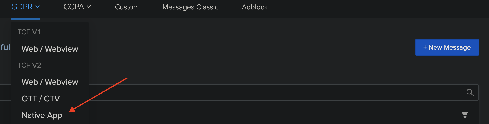

# The Nativemessage
## Table of Contents
- [Intro](#intro)
- [Configure a property to use with the Nativemessage](#configure-a-property-to-use-with-the-nativemessage)
- [How to Install](#how-to-install)
- [The Lifecycle](#the-lifecycle)
    - [The Webmessage VS Nativemessage lifecycle](#the-webmessage-vs-nativemessage-lifecycle)
- [The `onNativeMessageReady` callback](#the-onnativemessageready-callback)
    - [The `MessageStructure` obj](#the-messagestructure-obj)
    - [The `NativeMessageController` obj](#the-nativemessagecontroller-obj)
- [A complete example](#a-complete-example)  

## Intro
Until now customers needed to use the SDK to create the consent pop-up. Thanks to the new `Nativemessage` feature, customers can now choose to create the consent view using their own native layout. 

## Configure a property to use with the Nativemessage
From our Message Builder, choose the `Native App` option to create the new native property and the press on `New Message`.
Now you can add you native fields.



## How to Install
To install the SDK follow the instruction in the [main page](README.md#how-to-install).

## The Lifecycle

The Nativemessage lifecycle is similar to the one of the Webmessage, we have however some difference:
- After calling the `loadMessage`  function to get the consent message, only the `onNativeMessageReady` will be triggered.
The callback `onUIReady` is **not invoked** anymore.
- After taking an action, like pressing on `Accept All` button, the callbacks `onAction` and `onUIFinished` are not called anymore.
This because the client app now knows exactly when the action happened.
  
### The Webmessage VS Nativemessage lifecycle

This is a comparison of the two lifecycles during different kind of actions or use cases:

#### Use case: the `Accept all` action

| Web message      	| Native message         	| Event                                	|
|------------------	|------------------------	|--------------------------------------	|
| `onUIReady`      	| `onNativeMessageReady` 	| called after `loadMessage`           	|
| `onAction`       	|                        	| called after the button `Accept All` 	|
| `onUIFinished`   	|                        	| called after the button `Accept All` 	|
| `onConsentReady` 	| `onConsentReady`       	| called after the button `Accept All` 	|
| `onSpFinish`     	| `onSpFinish`           	| called after the button `Accept All` 	|

#### Use case: an already given consent

| Web message      	| Native message         	| Event                                	|
|------------------	|------------------------	|--------------------------------------	|
| `onUIReady`      	| `onNativeMessageReady` 	| called after `loadMessage`           	|
| `onConsentReady` 	| `onConsentReady`       	| called after `loadMessage` 	        |
| `onSpFinish`     	| `onSpFinish`           	| called after `loadMessage` 	        |

## The `onNativeMessageReady` callback
After the `loadMessage` is triggered, the cmp SDK will give back the consent configuration created with the cmp web Builder.
This callback has two parameters:
- MessageStructure
- NativeMessageController

### The `MessageStructure` obj

The MessageStructure object contains all the info related to current consent like the title, the body, the actions, etc... 
The actions are listed in a `List<NativeAction>` collection where each item contains the action type, its style and other useful info,
following the `MessageStructure` structure:

```
MessageStructure
    |-- messageComponents: MessageComponents?
    |   |-- name: String                          // Nativemessage name in the web builder
    |   |-- title: NativeComponent?               // Title set in the web builder
    |   |-- body: NativeComponent?                // Body set in the web builder
    |   |-- actions: List<NativeAction>           // List of available actions
    |   |-- customFields: Map<String, String>     // custom Key-value pairs added from the web builder
    |-- campaignType: CampaignType                // campaign type e.g. CampaignType.GDPR
```

```
NativeAction
    |-- text: String                              // Action text
    |-- style: NativeStyle                        // Style object
    |-- customField: Map<String, String>          // custom Key-value pairs
    |-- choiceType: NativeMessageActionType       // Action type e.g ACCEPT_ALL, CANCEL, REJECT_ALL, etc..
    |-- legislation: CampaignType                 // campaign type e.g. CampaignType.GDPR
```

```
NativeStyle
    |-- fontFamily: String
    |-- fontWeight: Float
    |-- fontSize: Float
    |-- color: String?
    |-- backgroundColor: String
```

### The `NativeMessageController` obj

The `NativeMessageController` object gives you the API to handle the consent lifecycle, 

```
NativeMessageController
    |-- sendConsent(NativeMessageActionType, CampaignType)    // Save the consent
    |-- showOptionNativeMessage(CampaignType, pmId: String)   // Surface the Web PM int a Webview
    |-- fun showNativeView(View)                              // Surface the client native layout for the consent
    |-- fun removeNativeView(View)                            // Remove the consent native layout
```

following the list of the 
available functions:
- `sendConsent`: the sendConsent function gives you the chances to store the consent related to the users choice, 
  if, for instance, the user decide to accept all the consent, the `sendConsent` function should be executed with the 
  following config:
  ```kotlin
  sendConsent(NativeMessageActionType.ACCEPT_ALL, message.campaignType)
  ```
- `showOptionNativeMessage`: allows the client app to surface the web PM using the `pmId`,
- `showNativeView`: allows the client app to inject its own native layout into our SDK and use it to show the consent,
- `removeNativeView`: allows the app to remove the native layout after the user take an action.

## A complete example
A complete example can be found into the `samples/nat-message-demo`


