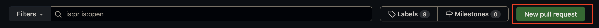
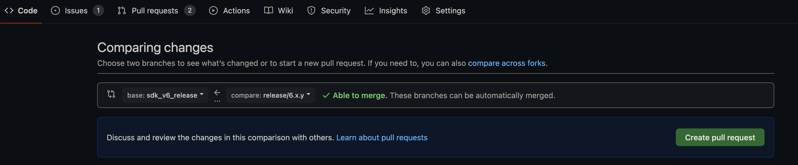
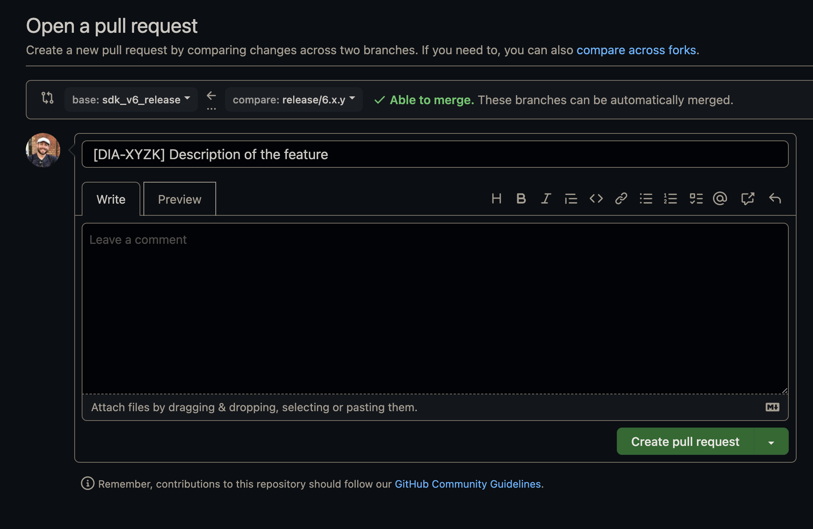
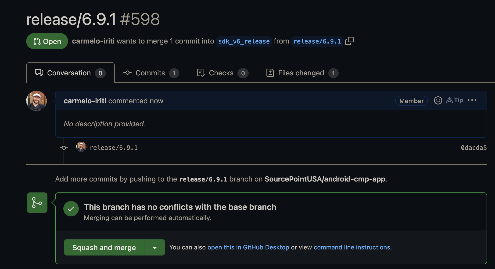
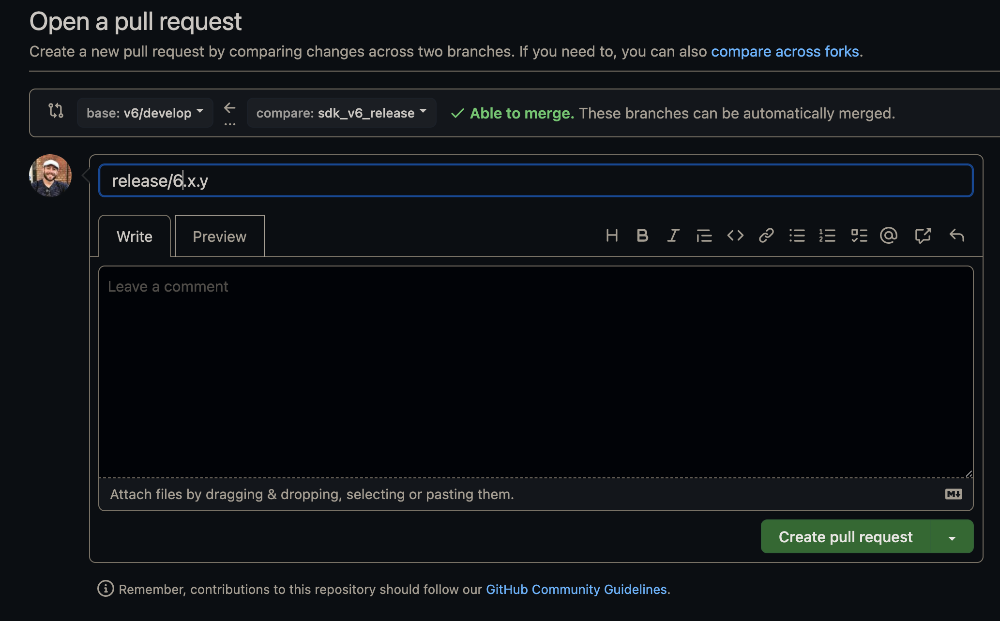

# V6 Release artifact

## Steps
1. Checkout `v6/develop` branch and pull the latest commits.
    ```
    git checkout v6/develop
    git pull
    ```
2. Create a new branch based on pure `v6/develop` branch code named `release/x.y.z` where x.y.z stands for ordinal version of upcoming release. Push it to `origin`.
    ```
    git checkout -b release/x.y.z
    git push --set-upstream origin release/x.y.z
    ```

3. Using your preferred text editor, go to `cmplibrary/grade.property` and upgrade `VERSION_NAME = x.y.z`. Don't forget to save the changes!
4. Then go to `cmplibrary/release_note.txt`, clear it and fulfill with description of every single commit pushed to `v6/develop`
   branch since the last artifact release. Please, stick to style of description which appears in that file!
   This part will appear in changelog after artifact release will be accomplished.
5. Commit and push these two files **ONLY**. The commit message **MUST** be “release/x.y.z”. The reason of such strict
   rules relates to our automated release process;
    ```
    git add .
    git commit -m “release/x.y.z”
    git push
    ```
6. Create a new MR from the GitHub Pull Requests page using your `release/x.y.z` branch







7. After the creation of the PR, hit `Squash and merge` to trigger the workflow to create the new artifact



8. At the end of the process, you should add the changes to the `v6/develop` branch.




