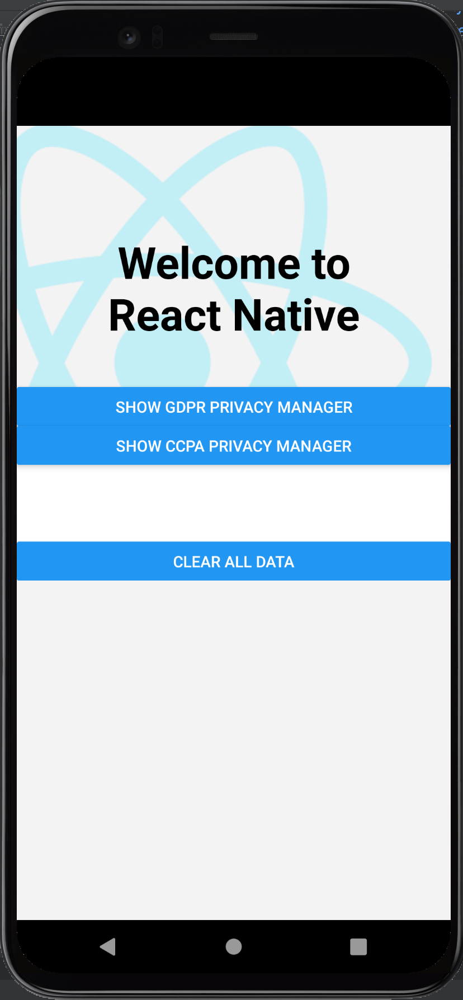
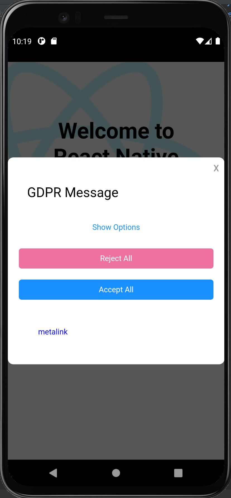
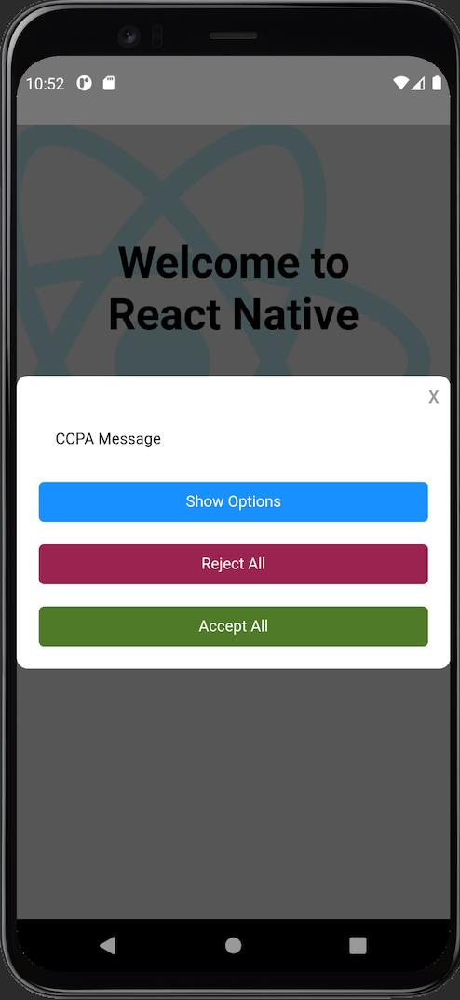

# Android Soft Integration

## Table of Contents
- [What we are aiming for](#what-we-are-aiming-for)
- [Compatibility](#compatibility)
- [How to Install the CMP SDK](#how-to-install-the-cmp-sdk)
- [The support CmpMainActivity](#the-support-CmpMainActivity)
- [Load the First Layer Message](#load-the-first-layer-message)
- [Load the Privacy Manager](#load-the-privacy-manager)
    - [The Android Native Modules](#the-android-native-modules)
    - [Calling native module from Javascript](#calling-native-module-from-javascript)
    - [Surfacing the Privacy Manager from the SpModule](#surface-the-privacy-manager-from-the-spmodule)
- [The full example android project](https://github.com/SourcePointUSA/CmpReactNativeIntegration/tree/soft/android)

## What we are aiming for
The Soft integration is employed whenever, for some reason, the SDK configuration needs to be outside the android `MainActivity` 
which is used from the ReactNative framework.

Following the final result:

  

#Compatibility
The Soft Integration can be used with versions prior to the `v6.6.1`

## How to Install the CMP SDK
To use `cmplibrary` in your ReactNative app, include `com.sourcepoint.cmplibrary:cmplibrary:x.y.z` as a dependency to 
the android project's build.gradle file and reload your gradle dependencies.

```
...
dependencies {
    implementation 'com.sourcepoint.cmplibrary:cmplibrary:X.Y.Z'
}
```

Current SDK version:

[](https://search.maven.org/search?q=g:com.sourcepoint.cmplibrary)

## The support CmpMainActivity

In order to surface the Cmp dialog, it is necessary having a support activity which contains the SDK configuration and 
the instance object of our SDK.

First we need a layout for our support activity, you can create an empty layout or using the following one which 
contains a simple `ProgressBar`

```xml
<?xml version="1.0" encoding="utf-8"?>
<RelativeLayout xmlns:android="http://schemas.android.com/apk/res/android"
        android:id="@+id/cmp_container"
        android:layout_width="match_parent"
        android:layout_height="match_parent"
        android:background="@android:color/transparent"
        android:visibility="visible"
        android:orientation="horizontal">

    <ProgressBar
            android:id="@+id/spinner"
            android:layout_height="75dp"
            android:layout_width="75dp"
            android:layout_gravity="center"
            android:indeterminate="true"
            android:layout_centerInParent="true" />
</RelativeLayout>
```

Now we can create a support activity with the SDK config:

```java
public class CMPActivity extends Activity {

    final private SpConfig mSpConfig = new SpConfigDataBuilder()
            .addAccountId(22)
            .addPropertyName("mobile.multicampaign.demo")
            .addMessageLanguage(MessageLanguage.ENGLISH)
            .addCampaignsEnv(CampaignsEnv.PUBLIC)
            .addCampaign(new SpCampaign(CampaignType.GDPR, Collections.emptyList()))
            .addCampaign(CampaignType.GDPR)
            .addCampaign(CampaignType.CCPA)
            .build();

    private SpConsentLib mSpConsentLib = null;
    private View mSpinner = null;

    @Override
    protected void onCreate(Bundle savedInstanceState) {
        super.onCreate(savedInstanceState);
        setContentView(R.layout.cmp_activity);

        mSpinner = findViewById(R.id.spinner);

        mSpConsentLib = FactoryKt.makeConsentLib(mSpConfig, this, new LocalClient());
    }

    @Override
    protected void onResume() {
        super.onResume();
        // adding logic to choose which api to trigger
//        mSpConsentLib.loadPrivacyManager("1234", PMTab.DEFAULT, CampaignType.GDPR);
        mSpConsentLib.loadMessage();
    }

    @Override
    protected void onDestroy() {
        super.onDestroy();
        disposeCmpLib();
    }

    class LocalClient implements SpClient {

        @Override
        public void onSpFinished(@NotNull SPConsents sPConsents) {
            finish();
            // add some nice effect in/out
        }

        @Override
        public void onUIFinished(View view) {
            if (mSpConsentLib != null) {
                mSpConsentLib.removeView(view);
            }
        }

        @Override
        public void onUIReady(View view) {
            if (mSpConsentLib != null) {
                mSpConsentLib.showView(view);
            }
            if (mSpinner != null) {
                mSpinner.setVisibility(View.GONE);
            }
        }

        @Override
        public void onError(Throwable error) {
            disposeCmpLib();
            finish();
        }

        @NotNull
        @Override
        public ConsentAction onAction(@NotNull View view, @NotNull ConsentAction consentAction) {
            return consentAction;
        }

        @Override
        public void onNativeMessageReady(@NotNull MessageStructure messageStructure, @NotNull NativeMessageController nativeMessageController) { }

        @Override
        public void onMessageReady(JSONObject message) {}

        @Override
        public void onNoIntentActivitiesFound(@NotNull String url) { }

        @Override
        public void onConsentReady(SPConsents consents) { }
    }
    
    private void disposeCmpLib(){
        if (mSpConsentLib != null) {
            mSpConsentLib.dispose();
            mSpConsentLib = null;
        }
    }
}
```

Declare it into the `AndroidManifest.xml`

```xml
<manifest>
    ...
    <application>
        ...
        <activity
                android:name=".CMPActivity"
                android:theme="@style/Theme.AppCompat.Transparent.NoActionBar"
                android:exported="false"
                android:configChanges="keyboard|keyboardHidden|orientation|screenSize" />
        ...
    </application>
    ...
</manifest>
```

and add the following style into your `style.xml` file

```xml
<resources>
    ...
    <style name="Theme.AppCompat.Transparent.NoActionBar" parent="Theme.AppCompat.Light.NoActionBar">
        <item name="android:windowIsTranslucent">true</item>
        <item name="android:windowBackground">@android:color/transparent</item>
        <item name="android:windowContentOverlay">@null</item>
        <item name="android:windowNoTitle">true</item>
        <item name="android:windowIsFloating">false</item>
        <item name="android:backgroundDimEnabled">false</item>
        <item name="android:statusBarColor">@android:color/transparent</item>
    </style>
    ...
</resources>
```


## Load the First Layer Message
In order to surface the FLM, we need to invoke the support activity from the `onCreate` callback of the ReactNative 
`ReactActivityDelegate` located into the `MainActivity` of the `android` folder.

This is how the `ReactActivityDelegate` should look like

```java
    public static class MainActivityDelegate extends ReactActivityDelegate {
        public MainActivityDelegate(ReactActivity activity, String mainComponentName) {
            super(activity, mainComponentName);
        }
        
        // ...

        @Override
        protected void onCreate(Bundle savedInstanceState) {
            super.onCreate(savedInstanceState);

            // soft integration
            Intent myIntent = new Intent(getPlainActivity(), CMPActivity.class);
            getPlainActivity().startActivity(myIntent);
        }

        // ...
    }
```

The reason why we use the `onCreate` callback in the `Soft Integratio` is that we need to avoid a loop in case, 
for instance, the FLM contains a `Cancel` button.

## Load the Privacy Manager
The FLM requires is triggered invoking the `loadMessage` from the `onResume` callback

```java
    @Override
    protected void onResume() {
      // ...
      mSpConsentLib.loadMessage();
      // ...
    }
```

## Load the Privacy Manager

The surfacing process of a PM involve the communication between the common ReactNative layer and the mobile native part.
To overcome the cross-platform communication challenge we make use of the [Native Modules](https://reactnative.dev/docs/native-modules-intro)

### The Android Native Modules

The first step, is the creation of the function that you need on native part like an implementation on native apps. We will create a file called `SpModule` on the android side of our React Native app.

The `SpModule` has all the functions that we need to expose to the Javascript side. In our example, we have three
buttons, two of them surface a GDPR and a CCPA Privacy Manager and one of them is clearing the saved local data:
- `showCcpaPm`: surfaces the CCPA PM,
- `showGdprPm`: surfaces the GDPR PM,
- `clearData`: deletes local data.

```java
public class SpModule extends ReactContextBaseJavaModule {

    // ...

    SpModule(ReactApplicationContext context) {
        super(context);
    }

    @NonNull
    @Override
    public String getName() {
        return "SpModule";
    }

    @ReactMethod
    public void showGdprPm() {
      // ...
    }

    @ReactMethod
    public void showCcpaPm() {
        // ...
    }

    @ReactMethod
    public void clearData() {
        SpUtils.clearAllData(getCurrentActivity());
    }
}
```

## Calling native module from Javascript

To be able to execute the native methods, we need to use the NativeModules from react-native.

In your `App.js` file import the module that we just created:

```javascript
import { NativeModules } from 'react-native';
const { SpModule } = NativeModules;
```

Now you can invoke the functions using the `SpModule` object as follows:

```javascript
  // ...
  <Button title="Show GDPR Privacy Manager" onPress={() => SpModule.showGdprPm() } />
  <Button title="Show CCPA Privacy Manager" onPress={() => SpModule.showCcpaPm() } />
  <Button title="Clear All Data" onPress={() => SpModule.clearData() } />
  // ...
```
