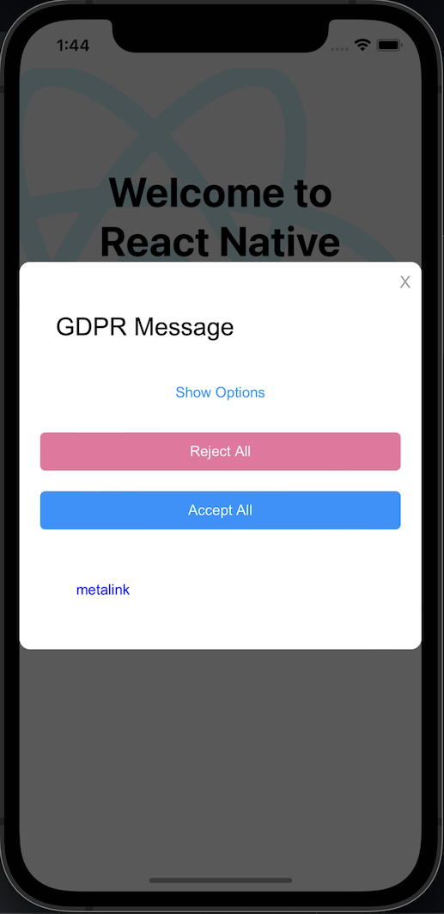
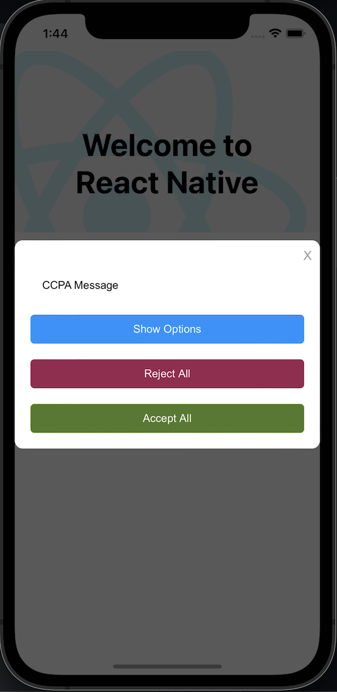

# Ios Integration

## Table of Contents
- [What we are aiming for](#what-we-are-aiming-for)
- [How to Install the CMP SDK](#how-to-install-the-cmp-sdk)
- [The support CmpViewController](#the-support-cmpViewController)
- [Load the First Layer Message](#load-the-first-layer-message)
- [Load the Privacy Manager](#load-the-privacy-manager)
  - [The IOS Native Modules](#the-ios-native-modules)
  - [Calling native module from Javascript](#calling-native-module-from-javascript)
  - [Surfacing the Privacy Manager from the SpModule](#surface-the-privacy-manager-from-the-spmodule)
- [The full example IOS project](https://github.com/SourcePointUSA/CmpReactNativeIntegration/tree/soft/ios)

# What we are aiming for
The purpose of this document is to show you how to integrate our SDK in a ReactNative application using a test property, at the end you'll have the following result

  

## How to Install the CMP SDK

In the Podfile of the ReactNative IOS project, add the CMP framework dependence to your app target:

```shell
target 'CmpReactNativeIntegration' do
  ...
  pod 'ConsentViewController', 'X.Y.Z'
  ...
end
```

and then execute
```shell
pod install
```

## The support CmpViewController

In order to use the capabilities of our Cmp Framework, it is necessary to use a support ViewController within which adding
the framework configuration. The `CmpViewController` simply extends the standard UIViewController with the consent functions. 

```swift
import Foundation
import ConsentViewController

class CmpViewController: UIViewController {
  
    lazy var consentManager: SPConsentManager = { SPConsentManager(
        accountId: 22,
        propertyName: try! SPPropertyName("mobile.multicampaign.demo"),
        campaignsEnv: .Public, // optional - Public by default
        campaigns: SPCampaigns(
            gdpr: SPCampaign(), // optional
            ccpa: SPCampaign(), // optional
            ios14: SPCampaign() // optional
        ),
        delegate: self
    )}()
  
  override func viewDidLayoutSubviews() {
    consentManager.cleanUserDataOnError = false
    consentManager.loadMessage()
  }
  
}

protocol RNSPDelegate : SPDelegate{} // used for objc - swift compatibility

extension CmpViewController: RNSPDelegate {
    func onSPUIReady(_ controller: UIViewController) {
        controller.modalPresentationStyle = .overFullScreen
        present(controller, animated: true)
    }

    func onAction(_ action: SPAction, from controller: UIViewController) {
        print(action)
        action.publisherData = ["foo": "action"]
        print(action)
    }

    func onSPUIFinished(_ controller: UIViewController) {
//        updateIDFAStatusLabel()
        dismiss(animated: true)
    }

    func onConsentReady(userData: SPUserData) {
        print("onConsentReady:", userData)
//        let vendorAccepted = userData.gdpr?.consents?.vendorGrants[myVendorId]?.granted ?? false
//        updateMyVendorUI(vendorAccepted)
//        updatePMButtons(ccpaApplies: consentManager.ccpaApplies, gdprApplies: consentManager.gdprApplies)
    }

    func onSPFinished(userData: SPUserData) {
        print("SDK DONE")
    }

    func onError(error: SPError) {
        print("Something went wrong: ", error)
    }
}

// MARK: - UI methods
extension MyViewController {
    func updateIDFAStatusLabel() {
        
    }

    func updateMyVendorUI(_ accepted: Bool) {
        
    }

    func updatePMButtons(ccpaApplies: Bool, gdprApplies: Bool) {
        
    }
}
```

The `CmpViewController` source is available [here](https://github.com/SourcePointUSA/CmpReactNativeIntegration/blob/ios/ios/CmpViewController.swift).

Now that the support `CmpViewController` is ready, it's the moment to replace the standard `UIViewController`. In the 
`AppDelegate.mm` file you should import the Cmp Framework

```obj-c
    #import "CmpReactNativeIntegration-Swift.h"
```

and then add the support `CmpViewController` just created. Find and replace the following line 
```obj-c
    UIViewController *rootViewController = [UIViewController new];
```
with this:
```obj-c
    CmpViewController *rootViewController = [CmpViewController new];
```

You can find [here](https://github.com/SourcePointUSA/CmpReactNativeIntegration/blob/soft/ios/CmpReactNativeIntegration/AppDelegate.mm) 
the final `AppDelegate.mm` file.

## Load the First Layer Message

The FLM requires is triggered invoking the `loadMessage` from the `viewDidLayoutSubviews` callback
```obj-c
  override func viewDidLayoutSubviews() {
    //...
    consentManager.loadMessage()
    //...
  }
```

## Load the Privacy Manager

The surfacing process of a PM involve the communication between the common ReactNative layer and the mobile native part.
To overcome the cross-platform communication challenge we make use of the [Native Modules](https://reactnative.dev/docs/native-modules-intro)

### The IOS Native Modules

The first step, is the creation of the function that you need on native part like an implementation on native apps. We will create a file called `SpModule.swift` on ios folder from our React Native app.


The `SpModule.swift` has all the functions that we need to expose to the Javascript side. In our example, we have three 
buttons, two of them surface a GDPR and a CCPA Privacy Manager and one of them is clearing the saved local data:
- `showCcpaPm`: surfaces the CCPA PM,
- `showGdprPm`: surfaces the GDPR PM,
- `clearData`: deletes local data.

Moreover, we need to implement a `requiresMainQueueSetup` function to manage our queue on main thread.

```swift
import Foundation
import ConsentViewController

@objc(SpModule)
class SpModule : NSObject {

  @objc static func requiresMainQueueSetup() -> Bool {
        return false
    }
  
  @objc
  func clearData() -> Void { }
  
  @objc
  func showCcpaPm() -> Void { }
  
  @objc
  func showGdprPm() -> Void { }
}

```

Note that we add `@objc` for the module and all its function, this means that this module and those functions will be 
called on Objective-C and you need these declarations to work as expected.

To expose our swift module to the Javascript side we need an `obj-c` bridge to connect the two worlds. Following the Objective-C
instance you need:

```obj-c
#import <Foundation/Foundation.h>

#import "React/RCTBridgeModule.h"
#import <React/RCTUtils.h>
@interface RCT_EXTERN_MODULE(SpModule, NSObject)

RCT_EXTERN_METHOD(showGdprPm)
RCT_EXTERN_METHOD(clearData)
RCT_EXTERN_METHOD(showCcpaPm)

@end
```

- `RCT_EXTERN_MODULE` is used to declare the module,
- `RCT_EXTERN_METHOD` is used to make available a function from the Javascript files.

## Calling native module from Javascript

To be able to execute the native methods, we need to use the NativeModules from react-native.

In your `App.js` file import the module that we just created:

```javascript
import { NativeModules } from 'react-native';
const { SpModule } = NativeModules;
```

Now you can invoke the functions using the `SpModule` object as follows:

```javascript
  // ...
  <Button title="Show GDPR Privacy Manager" onPress={() => SpModule.showGdprPm() } />
  <Button title="Show CCPA Privacy Manager" onPress={() => SpModule.showCcpaPm() } />
  <Button title="Clear All Data" onPress={() => SpModule.clearData() } />
  // ...
```

## Surface the Privacy Manager from the SpModule

In this scenario the main obstacle is that the `SpModule` doesn't have any instance of our cmp SDK, the SDK reference
is in `CmpViewController`. To establish the communication between the `SpModule` and the `CmpViewController`, we can use
a notification dispatch mechanism for broadcasting information to the registered observers, the `NotificationCenter`.
Following the full `SpModule`

```swift
import Foundation
import ConsentViewController

@objc(SpModule)
class SpModule : NSObject {

  @objc static func requiresMainQueueSetup() -> Bool {
        return false
    }
  
  @objc
  func clearData() -> Void {
    SPConsentManager.clearAllData()
  }
  
  @objc
  func showCcpaPm() -> Void {
    NotificationCenter.default.post(
      name: UIApplication.willEnterForegroundNotification,
      object: "ccpa"
    )
  }
  
  @objc
  func showGdprPm() -> Void {
    NotificationCenter.default.post(
      name: UIApplication.willEnterForegroundNotification,
      object: "gdpr"
    )
  }
}
```
Follows the configuration for receiving the message in the `CmpViewController` and surfacing the PM, [here](https://github.com/SourcePointUSA/CmpReactNativeIntegration/blob/ios/ios/CmpViewController.swift) the full source. 
```swift
class CmpViewController: UIViewController {
  
  deinit {
    NotificationCenter.default.removeObserver(
      self,
      name: UIApplication.willEnterForegroundNotification,
      object: nil
    )
  }
  
  // ...

  override func viewDidLayoutSubviews() {
    ...
    NotificationCenter.default.addObserver(
      self,
      selector: #selector(CmpViewController.pm(notification:)),
      name: UIApplication.willEnterForegroundNotification,
      object: nil
    )
  }
  
  @objc func pm(notification: Notification){
    let type = notification.object as? String  ?? ""
    if type.contains("gdpr") {
      showGdprPm()
    }else if type.contains("ccpa"){
      showCcpaPm()
    }
  }
  
  func showGdprPm() {
      DispatchQueue.main.async {
        self.consentManager.loadGDPRPrivacyManager(withId: "488393")
      }
    }

  func showCcpaPm() {
      DispatchQueue.main.async {
        self.consentManager.loadCCPAPrivacyManager(withId: "509688")
      }
    }

}
```
